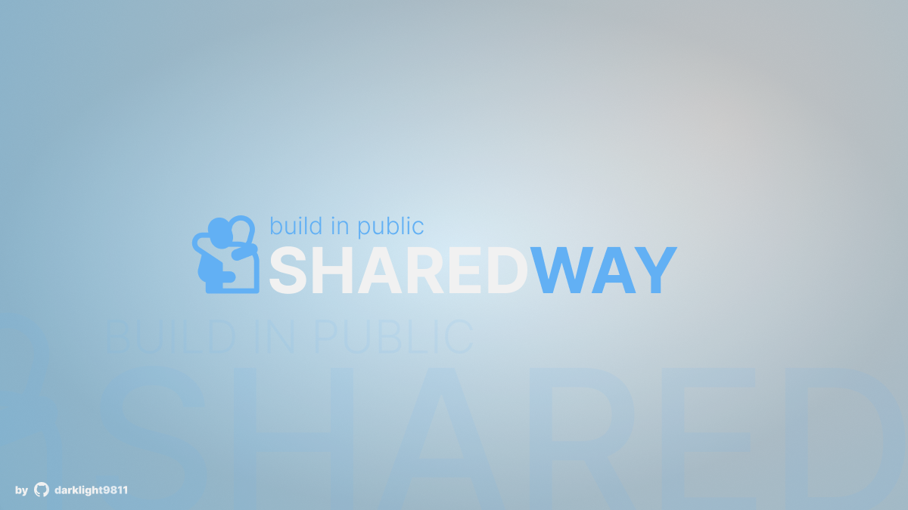

# SHAREDWAY

An application to help find missing people and animals. Serving as a central bank (or HUB) for institutions, the government and anyone can access the data. A difference is that it allows you to filter by region, so that you can see missing people or animals in the location with better distinction.

# Installation

- Clone this repository
- Run `bun install` on the root repository
- Create `.env` file from `.env.example` and populate it
- Run `bun dev --filter=app`