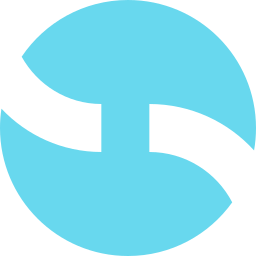

#  Sharedway

An application to help find missing people and animals. Serving as a central bank (or HUB) for institutions, the government and anyone can access the data. A difference is that it allows you to filter by region, so that you can see missing people or animals in the location with better distinction.

## Installation

> You will need to have API keys for: clerk, kv, uploadthing and a postgres database

- Clone this repository
- Run `bun install` on the root repository
- Create `.env` file from `.env.example` and populate it
- Run `bun db push`
- Populate with mock data using `bun db seed`
- Run `bun dev --filter=app`

## Powered by

